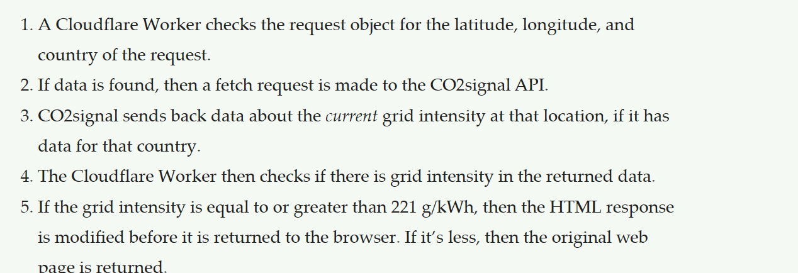

## Eco-friendly Server-Side Code

---

## Certain server-Side Languages are more efficient than others


Efficient code helps us create more sustainable web services.

---

 <!-- .element: style="height: 20vh" -->

Researchers ran energy tests of 27 programming languages, using standardized algorithmic problems from a project called the ["Computer Language Benchmarks Game"](https://benchmarksgame-team.pages.debian.net/benchmarksgame/)

[Energy Efficiency across Programming Languages](https://greenlab.di.uminho.pt/wp-content/uploads/2017/10/sleFinal.pdf)

---

### The Results


**Compiled languages fare hugely better** than interpreted languages (with the exception of Java)

---

## Get closer to the metal


The less transformation layers in your stack the better.

---


<small>SSVM = Second State WebAssembly VM = Runs (Rust code compiled to) WebAssembly</small>

[Evaluation of software stack performance](https://www.infoq.com/articles/arm-vs-x86-cloud-performance/#:~:text=on%20GitHub.-,Less%20software%20bloat,-To%20preserve%20software)

---

## Choose more energy efficient hardware


---


> ARM processors are designed to have the lowest possible energy consumption while maintaining high processing power.

[The next big thing – ARM architecture](https://www.layerstack.com/blog/the-next-big-thing-arm-architecture/)

---

### Where can you get ARM-based servers?

* [Hetzner](https://www.golem.de/news/cloud-hosting-hetzner-vermietet-kleinere-und-guenstigere-arm-server-2304-173366.html)
* [CloudFlare](https://blog.cloudflare.com/designing-edge-servers-with-arm-cpus/)
* [Amazon EC2](https://aws.amazon.com/de/ec2/graviton/)
* [Google Cloud](https://cloud.google.com/compute/docs/instances/arm-on-compute)
* [Microsoft Azure](https://azure.microsoft.com/en-us/blog/azure-virtual-machines-with-ampere-altra-arm-based-processors-generally-available/)

---

## Go for a more traditional Program Architecture

---


React, Angular and Vue.js are all great, but...

---

### They eat a lot of CPU cycles on the client!

 <!-- .element: style="height: 25vh; background: #141212" -->

> rendering a simple &lt;span&gt; in React [...] is between 2.15M to 2.2M CPU instructions. Then wrapping the &lt;span&gt; in a &lt;p&gt; takes us to about 2.3M instructions.

[JavaScript component-level CPU costs](https://calendar.perfplanet.com/2019/javascript-component-level-cpu-costs/)

---

As **you are not in control of the carbon footprint of your visitors**, but the one of your hosting provider, try **moving logic back to your server**.

---

### Consider a "HTML Over the Wire" Approach

<div class="r-logos">

 <!-- .element: style="height: 2vh" -->

 <!-- .element: style="height: 2vh" -->

 <!-- .element: style="height: 2vh" -->

 <!-- .element: style="height: 2vh" -->

</div>

<div class="r-hstack" style="align-items: center">

<br>SPA

vs. <!-- .element style="align-self: center" -->

<br>HTML over the Wire

</div>

---

## Make your Website Carbon-aware


What if we **adapt our website** based on the **visitor's electricity grid's current carbon emissions**?

---

 <!-- .element: style="height: 5vh" -->

### CO2.js npm Package

> CO2.js is a JavaScript library that enables developers a way to estimate the emissions related to use of their apps, websites, and software.

[CO2.js](https://github.com/thegreenwebfoundation/co2.js)

---

```js
import { averageIntensity } from '@tgwf/co2';
const { data } = averageIntensity;
const { DEU } = data;
console.log({ DEU })
```

👇🏼

```json
{
    "country_code": "DEU",
    "country_or_region": "Germany",
    "year": 2022,
    "emissions_intensity_gco2_per_kwh": 385.467
}
```

---

OR...

---

 <!-- .element: style="height: 5vh" -->

### CO2signal API

> The CO2signal API gives you access to where the electricity in a specific region comes from, how it was produced and how much carbon was emitted to produce it. All free for non-commercial use.

[CO2signal](https://www.co2signal.com/)

---

```
curl 'https://api.co2signal.com/v1/latest?countryCode=DE'
  -H 'auth-token: myapitoken'
```

```json
{
  "_disclaimer": "This data is the exclusive property of Electricity Maps.",
  "status": "ok",
  "countryCode": "DE",
  "data": {
    "datetime": "2023-07-26T11:00:00.000Z",
    "carbonIntensity": 267,
    "fossilFuelPercentage": 24.19
  },
  "units": {
    "carbonIntensity": "gCO2eq/kWh"
  }
}
```

---

### Example:

  
<small>Modified page</small>&nbsp;&nbsp;&nbsp;&nbsp;&nbsp;&nbsp;&nbsp;&nbsp;&nbsp;&nbsp;&nbsp;&nbsp;&nbsp;&nbsp;&nbsp;&nbsp;&nbsp;&nbsp;&nbsp;&nbsp;&nbsp;&nbsp;&nbsp;&nbsp;&nbsp;&nbsp;&nbsp;&nbsp;&nbsp;&nbsp;&nbsp;&nbsp;&nbsp;&nbsp;&nbsp;&nbsp;&nbsp;&nbsp;&nbsp;&nbsp;&nbsp;&nbsp;&nbsp;&nbsp;&nbsp;&nbsp;&nbsp;&nbsp;&nbsp;&nbsp;&nbsp;&nbsp;&nbsp;&nbsp;&nbsp;&nbsp;&nbsp;<small>Original page</small>

</div>

[Making this website carbon aware](https://fershad.com/writing/making-this-website-carbon-aware/) by Fershad Irani

---

### How:



[Making this website carbon aware](https://fershad.com/writing/making-this-website-carbon-aware/) by Fershad Irani

---

### What:


[Making this website carbon aware](https://fershad.com/writing/making-this-website-carbon-aware/) by Fershad Irani

---


* Programming Language
* Functional Programming vs. OOP
* HTML vs. PHP CPU Cycles
* HTMLx as energy is under control server side
* Caching
* Static Genrrators
* Personalization is bad
* Serverless: minify JS/PHP
