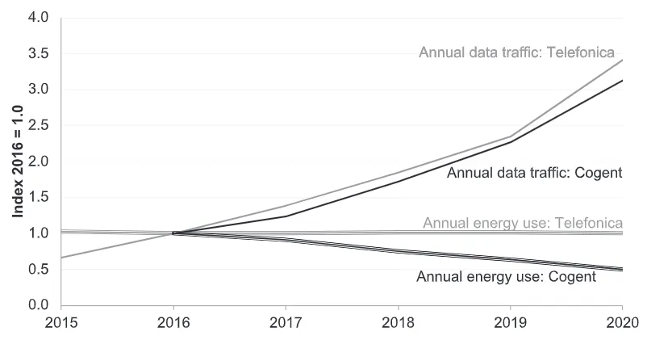
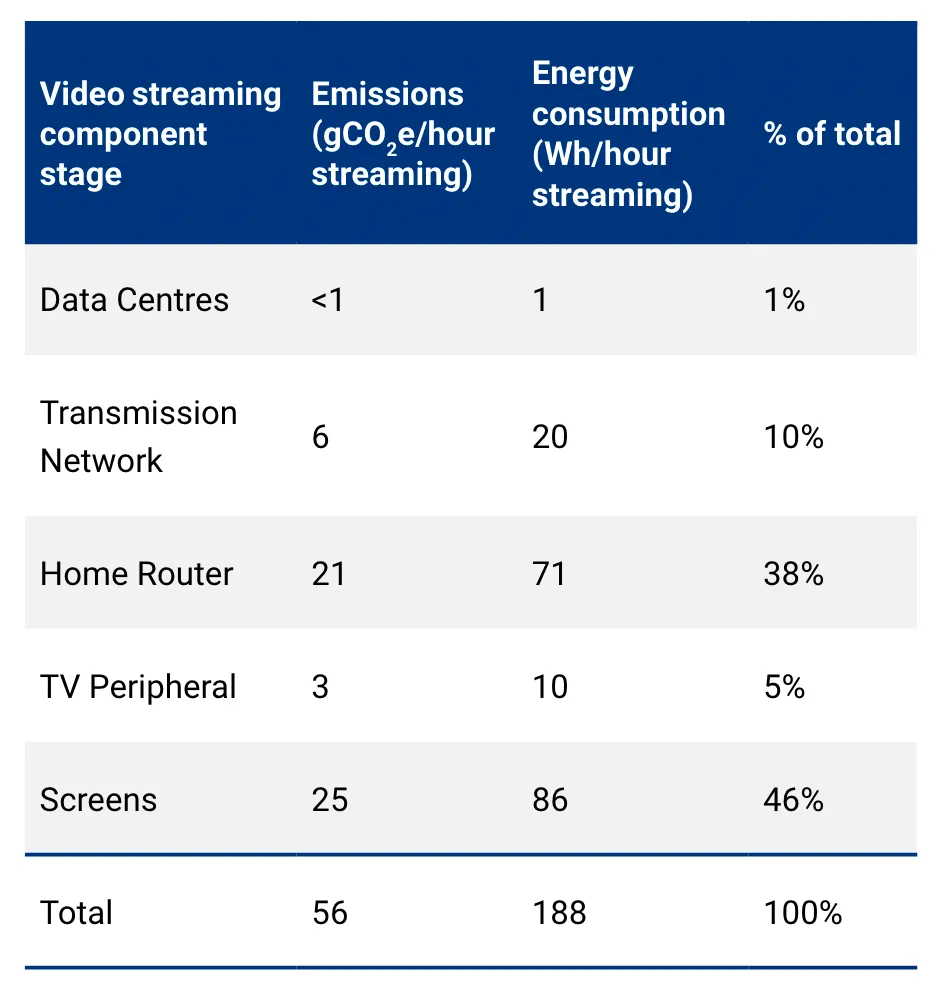

# Frontend

---

A performant website is an eco-friendly website

---

## Page Weight

[Web Almanac](https://almanac.httparchive.org/en/2022/page-weight)

---

**1 Gigabyte** of data transferred uses **0.81 kWh** of energy.

This factors in: consumer device use, network use, data center use and hardware production.

[Calculating Digital Emissions](https://sustainablewebdesign.org/calculating-digital-emissions/)

---

Producing **1 kWh** of energy in Germany produces **229g CO²**.

[Electricity Maps](https://app.electricitymaps.com/zone/DE)

---

### Carbon Footprint of Data in Germany

1 Gigabyte = 0.81 kWh &times; 229g CO² = **185g CO²**

1 Megabyte = **0.18g CO²**

---

Our household's **data consumption** in the last month: **1.323 Gigabytes**.

---

Our household's **digital carbon footprint** in the last month: **245 kg** CO².

That's **[like traveling 1.166 km by plane](https://www.quarks.de/umwelt/klimawandel/CO²-rechner-fuer-auto-flugzeug-und-co/)** every month.

---

### Measuring the Footprint of a Webpage

---

Network Tab in Devtools

---

<iframe src="https://www.websitecarbon.com/website/greenpeace-de/" style="width: 100%; height: 75vh"></iframe>

[Website Carbon Calculator](https://www.websitecarbon.com/)

---

[Measure & Improve Your Site's Footprint with Carbon Control from Catchpoint WebPageTest](https://blog.webpagetest.org/posts/carbon-control/)

---

### Truth to be told: 

Amount of data transferred is still just an approximation for energy consumption

---

 <!-- .element: style="height: 25vh" -->

> Network energy consumption **is not proportional to data transferred**. We can see this from statistics published by telecoms operators showing their network energy consumption decreased even as data volumes grew.

[Measuring website energy consumption via browser profiling](https://www.devsustainability.com/p/measuring-website-energy-consumption)

---

> The network is also not the largest source of energy consumption when looking at the system end to end. **The user device is often a large part of the environmental footprint** of a particular application. This varies significantly by device and also by application, but to take video streaming as a common application, the user device makes up ~50% of the total energy profile.

[Measuring website energy consumption via browser profiling](https://www.devsustainability.com/p/measuring-website-energy-consumption)

 <!-- .element: style="flex: 1 1 33%" -->

---

### But it's a good start

---
<!-- .slide: data-transition="fade" -->

[Web Almanac](https://almanac.httparchive.org/en/2022/page-weight)

---
<!-- .slide: data-transition="fade" -->

[Web Almanac](https://almanac.httparchive.org/en/2022/page-weight)

---

### Use a better Image Format

---

[Image Format Comparison (JPEG, PNG, WEBP, & AVIF) - 2023 Statistics](https://photutorial.com/image-format-comparison-statistics/)

---

  
JPEG @ 69,445 bytes

  
AVIF @ 40,811 bytes

[AVIF for Next-Generation Image Coding](https://netflixtechblog.com/avif-for-next-generation-image-coding-b1d75675fe4)

---

### What about the formats' energy consumptions?

---

Overall loading & decode energy consumption (shorter is better)  
The longer the network is active the more energy is consumed

[Which image format choose to reduce energy consumption and environmental impact?](https://greenspector.com/en/which-image-format-to-choose-to-reduce-its-energy-consumption-and-its-environmental-impact/)

---

Energy consumption for decoding alone (shorter is better)

[Which image format choose to reduce energy consumption and environmental impact?](https://greenspector.com/en/which-image-format-to-choose-to-reduce-its-energy-consumption-and-its-environmental-impact/)

---

Throuput for encoding (higher is better)

[Coding Comparisons](https://storage.googleapis.com/avif-comparison/subset1.html)

---

### The Winner Format: AVIF

---

### But AVIF is not always the best choice

<table>
  <thead>
  <tr>
    <th scope="col"><strong><em>Feature</em></strong></th>
    <th scope="col"><strong><em>JPEG</em></strong></th>
    <th scope="col"><strong><em>WebP</em></strong></th>
    <th scope="col"><strong><em>AVIF</em></strong></th>
  </tr>
  </thead>
  <tbody>
  <tr>
    <td>Alpha transparency</td>
    <td>❌</td>
    <td>✅</td>
    <td>✅</td>
  </tr>
  <tr>
    <td>HDR</td>
    <td>❌</td>
    <td>❌</td>
    <td>✅</td>
  </tr>
  <tr>
    <td>Effective lossless compression</td>
    <td>❌</td>
    <td>✅</td>
    <td>❌</td>
  </tr>
  <tr>
    <td>Progressive decoding</td>
    <td>✅</td>
    <td>❌</td>
    <td>❌</td>
  </tr>
  <tr>
    <td>Animation</td>
    <td>❌</td>
    <td>✅</td>
    <td>✅</td>
  </tr>
  </tbody>
</table>

 <!-- .element: style="height: 15vh; width: 70%; object-fit: cover; object-position: top center;" -->  
 <!-- .element: style="height: 5vh" -->

---

### Next big offender...

---

JavaScript!

[Web Almanac](https://almanac.httparchive.org/en/2022/page-weight)

---

## Reduce JavaScript

---

JavaScript **hits us multiple times**:

* First the **network** with its **download**
* then the **CPU** with **parse & compile** costs, 
* and finally the **CPU** again with its **execution** costs. 

[JavaScript Startup Optimization](https://web.dev/optimizing-content-efficiency-javascript-startup-optimization/)

---

Byte for byte, **JavaScript hits a lot harder** than image data.

[JavaScript Startup Optimization](https://web.dev/optimizing-content-efficiency-javascript-startup-optimization/)

---

### Can I measure the energy impact of my JavaScript?

---

**Safari** was the first browser to introduce tooling that measures energy impact.

It primarily focuses on CPU and is **directionally useful**, but doesn’t offer any specific numbers.

---

Recently **Firefox** added real energy consumption profiling to its devtools!

 <!-- .element: style="height: 33vh" -->

Firefox 104 supports **Windows 11** and **macOS on Apple Silicon** devices, Firefox 107 adds support for **Intel Mac** and **Linux**.

[Measuring website energy consumption via browser profiling](https://www.devsustainability.com/p/measuring-website-energy-consumption) / [Power profiling with the Firefox Profiler](https://fosdem.org/2023/schedule/event/energy_power_profiling_firefox/)

---

.svg)

> Use the least powerful language suitable for expressing information, constraints or programs on the World Wide Web

[W3C - The Rule of Least Power](https://www.w3.org/2001/tag/doc/leastPower.html)

---

 <!-- .element: style="height: 25vh" -->

> The past few months have ushered in a golden era for web UI. New platform capabilities have landed with tight cross-browser adoption that support more web capabilities and customization features than ever.

[What's new in CSS and UI: I/O 2023 Edition](https://developer.chrome.com/blog/whats-new-css-ui-2023/)

---

### HTML > CSS > Browser APIs > JavaScript

* ~Intersection Observer~ HTML's `loading="lazy"`
* ~Resize Observer~ CSS's Container Queries
* ~`Math`~ CSS's Trigonometric functions
* ~popper.js~ HTML's `popover` & CSS's anchor positioning
* ~Vue.js Transition~ Browser's View Transition API
* ~Select2~ `<selectmenu>`
* ~Greensock~ CSS's Scroll-driven animations
* ~Luxon~ ECMAScript's Intl

**Stay up to date with the Web Platform!**

---

Case Study: Scroll-driven Animations

[A case study on scroll-driven animations performance](https://developer.chrome.com/en/blog/scroll-animation-performance-case-study/)

---

### Another positive aspect of performant websites...

---

Old devices can still run your page well  
👉🏼 less incentive to upgrade  
👉🏼 less waste!

