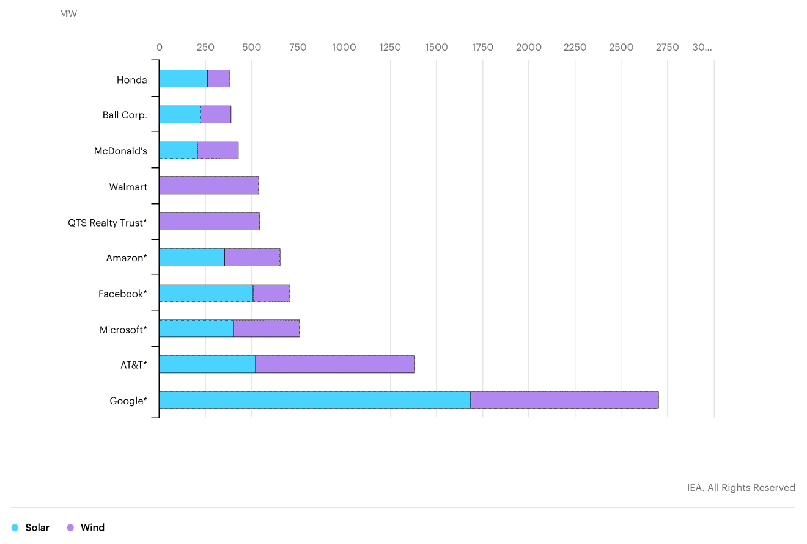
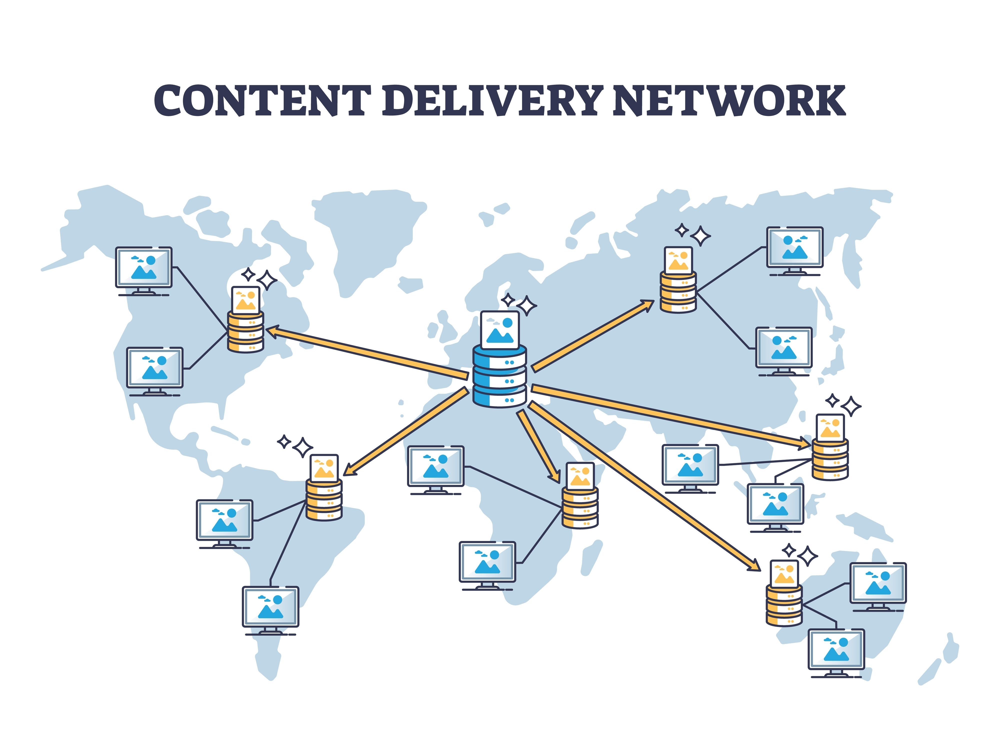

# Eco-friendly Hosting

---

## Purchasing Offsets: 

"Carbon neutral" vs. "Net zero"

---

### Carbon neutral ⭐

 <!-- .element: style="height: 25vh" -->

A company that is **"Carbon neutral"** **compensates for its emissions** by paying someone else to e.g. not cut down trees on the land they own. 

It doesn’t lead to planting more trees that would have a positive impact by removing carbon.

**[Google](https://services.google.com/fh/files/misc/google_2019-environmental-report.pdf)** has gone "carbon neutral" in 2007 and **[Microsoft](https://blogs.microsoft.com/blog/2020/01/16/microsoft-will-be-carbon-negative-by-2030/)** in 2012.

---

### Net zero ⭐⭐

 <!-- .element: style="height: 25vh" -->

**"Net zero"** means that a company actually **removes as much carbon as it emits**. 

The reason the phrase is “net zero” and not just “zero” is because there are still carbon emissions, but these are equal to carbon removal.

---

## Buying 100% renewable energy ⭐⭐⭐

A company **matches like-for-like** rather than matching emissions for emissions. Its buys as much renewable energy to match all its energy usage.

 <!-- .element: style="height: 33vh" -->  
[Google has been doing so since 2017](https://www.blog.google/outreach-initiatives/environment/meeting-our-match-buying-100-percent-renewable-energy/).

---

 <!-- .element: style="height: 25vh" -->

The problem with that is that whilst renewable energy is being generated somewhere, **that may not be where your data center is**.

---

## Buying 100% 24/7 local renewables ⭐⭐⭐⭐

 <!-- .element: style="height: 25vh" -->

Deploy renewable sources of energy on the local grid providing power 24/7.

[Google started work on this in 2018](https://www.blog.google/outreach-initiatives/sustainability/internet-24x7-carbon-free-energy-should-be-too/). It is approaching this through construction of its own renewable sources of energy that go directly into the local grid

---

## How to find a "green" Hosting company?

The Green Web Foundation has a directory of hosting providers from all around the world that provided evidence of their green services: 

[thegreenwebfoundation.org/directory](https://www.thegreenwebfoundation.org/directory/)

---

### Also: Use a CDN

 <!-- .element: style="height: 25vh" -->

Using a CDN can cut down on the travel distance of data across networks considerably.

[CloudFlare is a CDN provider that's at least carbon neutral](https://blog.cloudflare.com/the-climate-and-cloudflare/).
