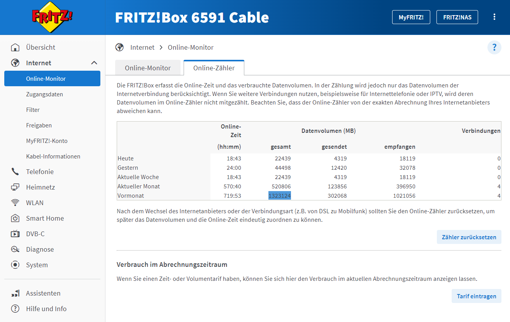

## Quantify & Measure

---

**1 Gigabyte** of data transferred uses **0.81 kWh** of energy.

This factors in: consumer device use, network use, data center use and hardware production.

[Calculating Digital Emissions](https://sustainablewebdesign.org/calculating-digital-emissions/)

---

Producing **1 kWh** of energy in Germany produces **229g CO²**.

[Electricity Maps](https://app.electricitymaps.com/zone/DE)

---

### Carbon Footprint of Data in Germany

1 Gigabyte = 0.81 kWh &times; 229g CO² = **185g CO²**

1 Megabyte = **0.18g CO²**

---

Our household's data consumption in the last month: **1.323 Gigabytes**.

---

Our household's digital carbon footprint in the last month: **245 kg** CO².

That's **[like traveling 1.166 km by plane](https://www.quarks.de/umwelt/klimawandel/CO²-rechner-fuer-auto-flugzeug-und-co/)** every month.
