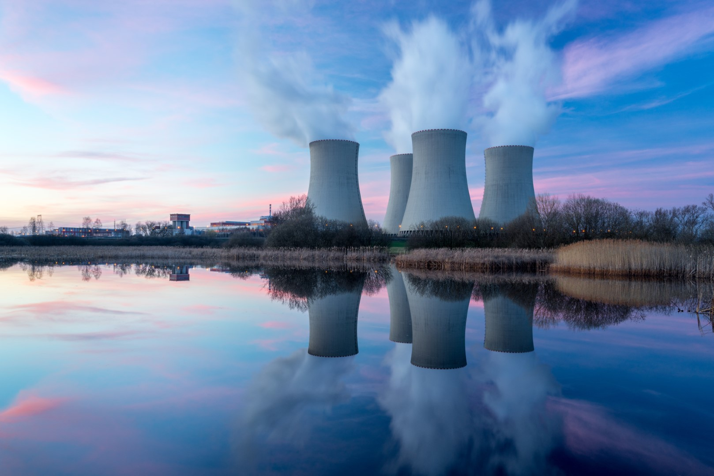
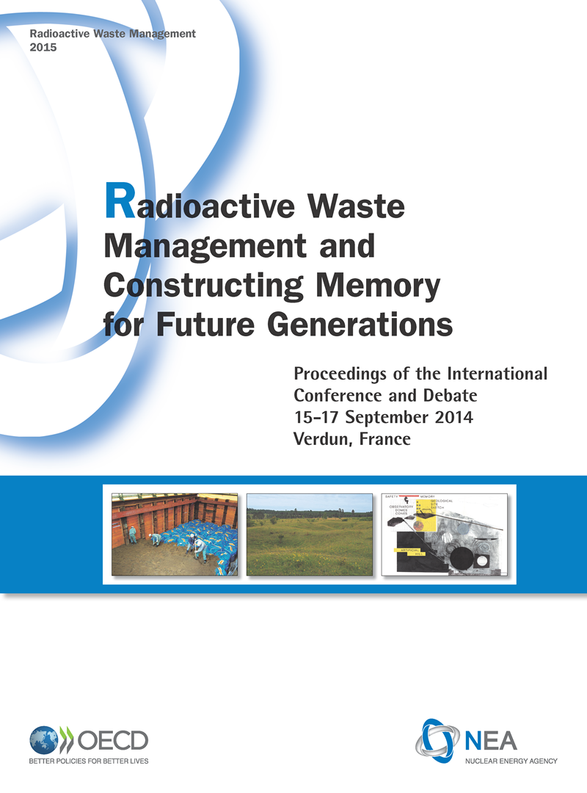

# Reduktion des CO2-Fußabdrucks von Energie

---

 <!-- .element: style="height: 33vh" -->

Wähle einen grünen Hoster!

---

⚠️ Aber Vorsicht, es gibt große Unterschiede darin, „grün“ zu sein!

---

Es gibt zwei unterschiedliche Strategien, die Rechenzentren anwenden:

* 💵 Kompensationen
* 🍃 Umstellung auf CO2-arme / erneuerbare Energien

---

## Kompensationen:

CO2-neutral vs. „Netto-Null“

---

### CO2-neutral ⭐

 <!-- .element: style="height: 25vh" -->

Ein **„CO2-neutrales“ Unternehmen **kompensiert seine Emissionen**, indem es jemand anderen z.B. dafür bezahlt, auf seinem Grund und Boden _keine_ Bäume zu fällen.

Es führt nicht dazu, dass mehr Bäume gepflanzt werden, die sich bei der Entfernung von Kohlenstoff aus der Luft positiv auswirken würden. <!-- .element class="fragment" -->

**[Google](https://services.google.com/fh/files/misc/google_2019-environmental-report.pdf)** wurde 2007 „CO2-neutral“ und **[Microsoft](https://blogs.microsoft.com/blog/2020/01/16/microsoft-will-be-carbon-negative-by-2030/)** im Jahr 2012.

---

### „Netto-Null“ ⭐⭐

 <!-- .element: style="height: 25vh" -->

**„Netto-Null“** bedeutet, dass ein Unternehmen, z.B. durch Aufforstung, tatsächlich **so viel CO2 entfernt, wie es ausstößt**.

Der Grund dafür, dass der Ausdruck „Netto-Null“ und nicht einfach „Null“ lautet, liegt darin, dass es immer noch Kohlenstoffemissionen gibt, diese jedoch im gleichen Verhältnis zu Kohlenstoffentfernung stehen. <!-- .element class="fragment" -->

---

Besser ist eine...

### Umstellung auf CO2-arme / erneuerbare Energien

---

 <!-- .element: style="height: 25vh" -->

**Erneuerbare Energie** wird aus **natürlichen Prozessen** gewonnen, die **sich ständig erneuern**:

<ul style="column-count: 2">
 <li>Solar</li>
 <li>Wind</li>
 <li>Ozean</li>
 <li>Solar</li>
 <li>Wasserkraft</li>
 <li>Biomasse</li>
 <li>Geothermie</li>
</ul>

---

 <!-- .element: style="height: 25vh" -->

Die Kategorie **"CO2-arm"** umfasst auch die Kernenergie.

Aber... <!-- .element class="fragment" -->

---

 <!-- .element: style="height: 33vh" -->

Ist es wirklich in Ordnung, Atommüll zu erzeugen, dessen Zersetzung 300.000 Jahre dauert, daraus aber nur für ein paar Jahre Energie gewonnen wird?

---

 <!-- .element: style="height: 33vh; border: 1px solid #ccc" -->

Wie können wir die Menschen in den kommenden 300.000 Jahren vor dem Atommüll überhaupt warnen?

Werden sie überhaupt unsere Sprache sprechen?

---

## Kauf von 100 % erneuerbarer Energie ⭐⭐⭐

Ein Unternehmen kauft so viel erneuerbare Energie ein, dass sein gesamter Energieverbrauch damit gedeckt wird.

 <!-- .element: style="height: 33vh" -->

[Google tut dies seit 2017](https://www.blog.google/outreach-initiatives/environment/meeting-our-match-buying-100-percent-renewable-energy/).

---

 <!-- .element: style="height: 25vh" -->

Das Problem dabei ist, dass zwar irgendwo erneuerbare Energie erzeugt wird, **nur möglicherweise nicht dort, wo der Strom verbraucht wird**.

---

## Kauf von 100 % lokalen erneuerbaren Energien ⭐⭐⭐⭐

 <!-- .element: style="height: 25vh" -->

Nutzung erneuerbarer Energiequellen **im lokalen Netz** rund um die Uhr.

[Google hat 2018 mit der Arbeit daran begonnen](https://www.blog.google/outreach-initiatives/sustainability/internet-24x7-carbon-free-energy-should-be-too/). Dies wird durch den Bau eigener erneuerbarer Energiequellen erreicht, die direkt in das lokale Stromnetz eingespeist werden

---

## Wie findet man ein „grünes“ Hosting-Unternehmen?

Die Green Web Foundation verfügt über ein Verzeichnis von Hosting-Anbietern aus aller Welt, die ihre Umweltfreundlichkeit nachgewiesen haben:

[thegreenwebfoundation.org/directory](https://www.thegreenwebfoundation.org/directory/)