# Reducing Energy Consumption

---

These aspects of digital products impact energy consumption:

* 📦 Data transport
* ⚙️Logic / data processing
* 🖥️ Displaying

---

**1 Gigabyte** of data transferred uses **0.81 kWh** of energy.

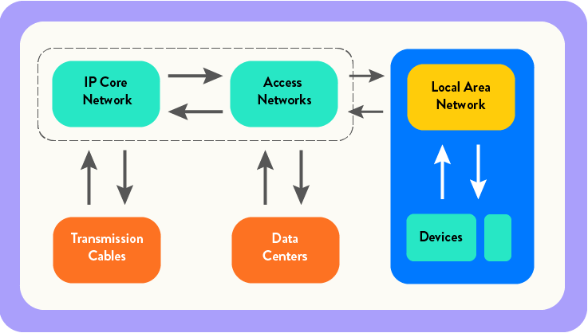 <!-- .element style="height: 25vh" -->

This factors in: 

* consumer device use, 
* network use, 
* data center use and 
* hardware production.

[Calculating Digital Emissions](https://sustainablewebdesign.org/calculating-digital-emissions/)

**Disclaimer: Amount of data transferred is still just an approximation for energy consumption.** <!-- .element class="fragment" -->

---

 <!-- .element: style="border: 1px solid #ccc" -->

Producing **1 kWh** of energy in Germany created **372g CO²** on average 
in 2023.

[Electricity Maps](https://app.electricitymaps.com/zone/DE)

---

### Carbon Footprint of Data in Germany

1 Gigabyte = 0.81 kWh &times; 372g CO² = **301g CO²**

1 Megabyte = **0.30g CO²**

---

 <!-- .element: style="border: 1px solid #ccc" -->

Our household's **data consumption** in one month: **1,323 Gigabytes**.

---

Our household's **digital carbon footprint** in one month: **398 kg** CO².

That's **[like traveling 1,666 km by plane](https://www.quarks.de/umwelt/klimawandel/CO2-rechner-fuer-auto-flugzeug-und-co/)** every month.

---

## Average Page Weight

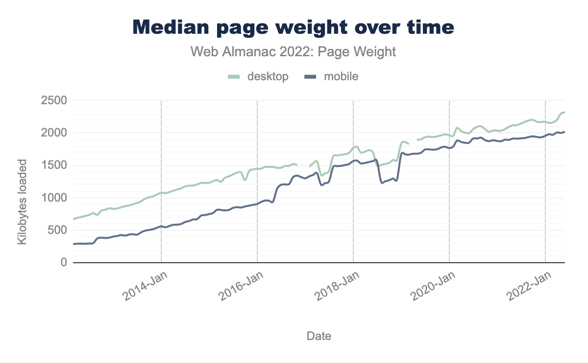

[Web Almanac](https://almanac.httparchive.org/en/2022/page-weight)

---

### Measuring the Footprint of a Webpage

---

 <!-- .element: style="border: 1px solid #ccc" -->

Network Tab in Devtools

---

<iframe src="https://www.websitecarbon.com/website/greenpeace-de/" style="width: 100%; height: 50vh"></iframe>

[Website Carbon Calculator](https://www.websitecarbon.com/)

---

[Measure & Improve Your Site's Footprint with Carbon Control from Catchpoint WebPageTest](https://blog.webpagetest.org/posts/carbon-control/)

---

The main offender...

---
<!-- .slide: data-transition="fade" -->

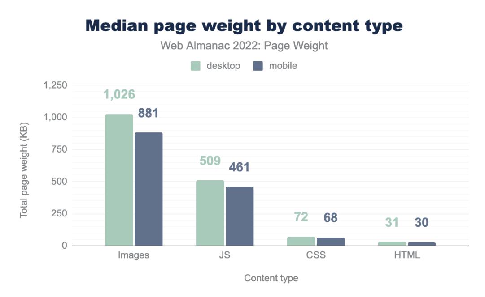

[Web Almanac](https://almanac.httparchive.org/en/2022/page-weight)

---
<!-- .slide: data-transition="fade" -->

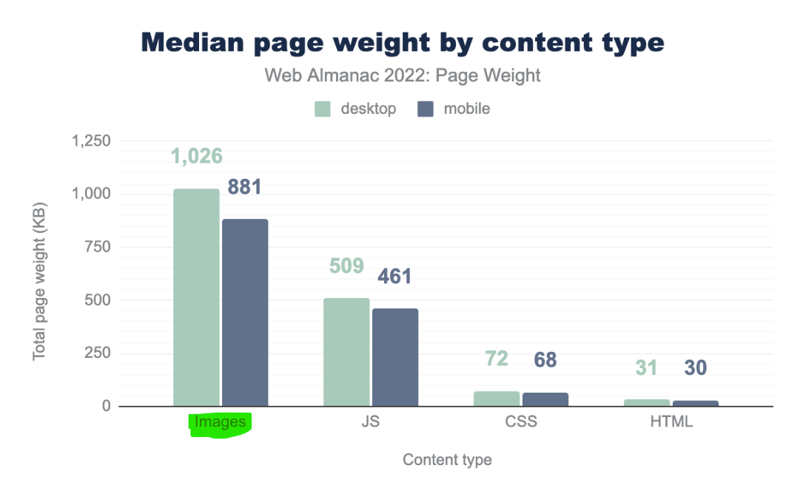

[Web Almanac](https://almanac.httparchive.org/en/2022/page-weight)

---

### Use a better Image Format

---

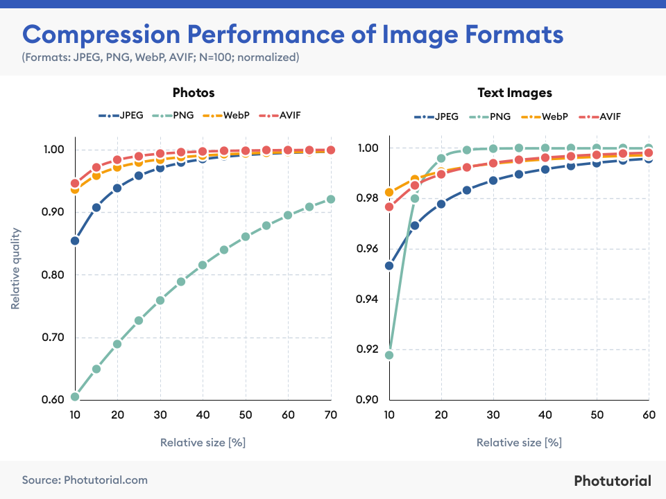

[Image Format Comparison (JPEG, PNG, WEBP, & AVIF) - 2023 Statistics](https://photutorial.com/image-format-comparison-statistics/)

---

  
JPEG @ 69,445 bytes

  
AVIF @ 40,811 bytes

[AVIF for Next-Generation Image Coding](https://netflixtechblog.com/avif-for-next-generation-image-coding-b1d75675fe4)

---

### What about the formats' energy consumptions?

---

Overall loading & decode energy consumption (shorter is better)  
The longer the network is active the more energy is consumed

 <!-- .element style="height: 33vh" -->

[Which image format choose to reduce energy consumption and environmental impact?](https://greenspector.com/en/which-image-format-to-choose-to-reduce-its-energy-consumption-and-its-environmental-impact/)

---

Energy consumption for decoding alone (shorter is better)

 <!-- .element style="height: 33vh" -->

[Which image format choose to reduce energy consumption and environmental impact?](https://greenspector.com/en/which-image-format-to-choose-to-reduce-its-energy-consumption-and-its-environmental-impact/)

---

Throuput for encoding (higher is better)

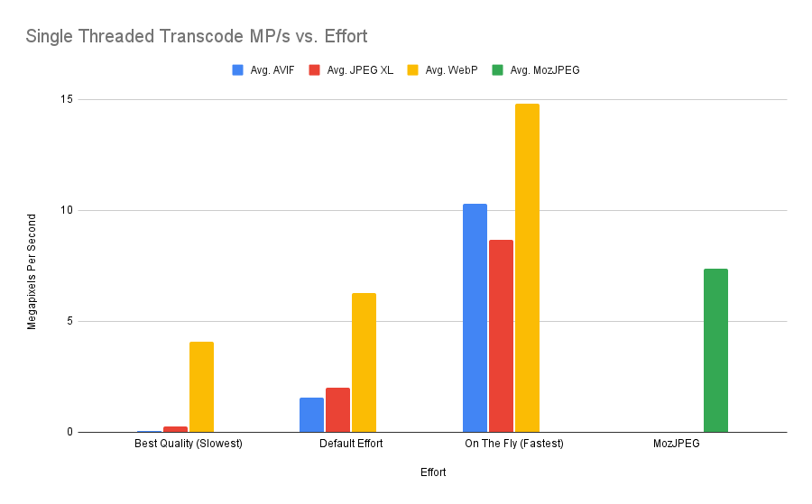

[Coding Comparisons](https://storage.googleapis.com/avif-comparison/subset1.html)

---

### The Winner Formats: AVIF & WebP!

---

Next big offender...

---

JavaScript!

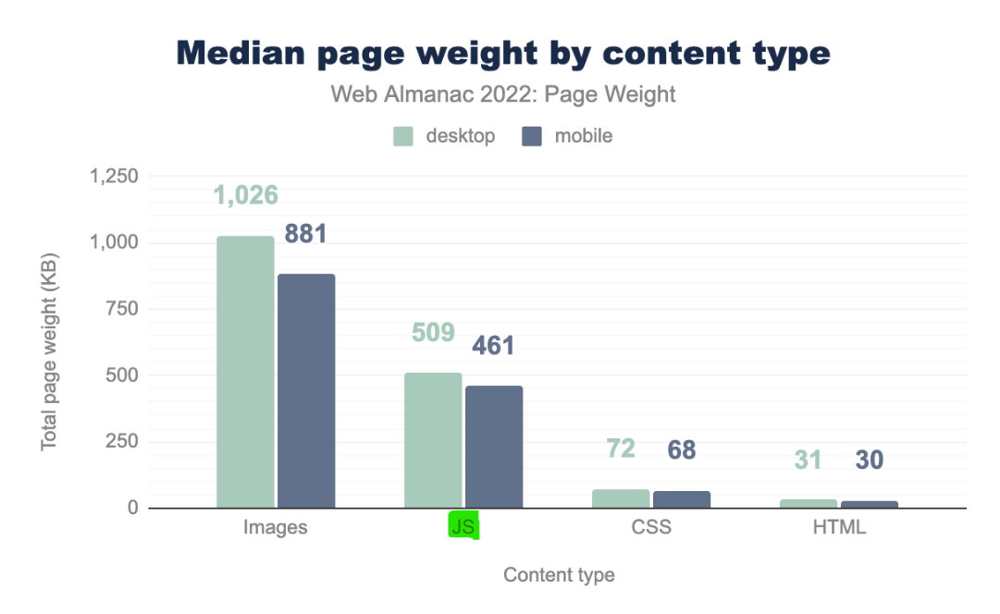

[Web Almanac](https://almanac.httparchive.org/en/2022/page-weight)

---

JavaScript **hits us multiple times**:

* First the **network** with its **download**
* then the **CPU** with **parse & compile** costs,
* and finally the **CPU** again with its **execution** costs.

[JavaScript Startup Optimization](https://web.dev/optimizing-content-efficiency-javascript-startup-optimization/)

---

Byte for byte, **JavaScript hits a lot harder** than image data.

[JavaScript Startup Optimization](https://web.dev/optimizing-content-efficiency-javascript-startup-optimization/)

---

### Can I measure the energy impact of my JavaScript?

---

**Safari** was the first browser to introduce tooling that measures energy impact.

 <!-- .element style="height: 25vh" -->

It primarily focuses on CPU and is **directionally useful**, but doesn’t offer any specific numbers.

---

Recently **Firefox** added **REAL** energy consumption profiling to its devtools!

 <!-- .element: style="height: 25vh" -->

[Measuring website energy consumption via browser profiling](https://www.devsustainability.com/p/measuring-website-energy-consumption) / [Power profiling with the Firefox Profiler](https://fosdem.org/2023/schedule/event/energy_power_profiling_firefox/)

---

React, Angular and Vue.js are all great, but...

---

### They eat a lot of CPU cycles on the client!

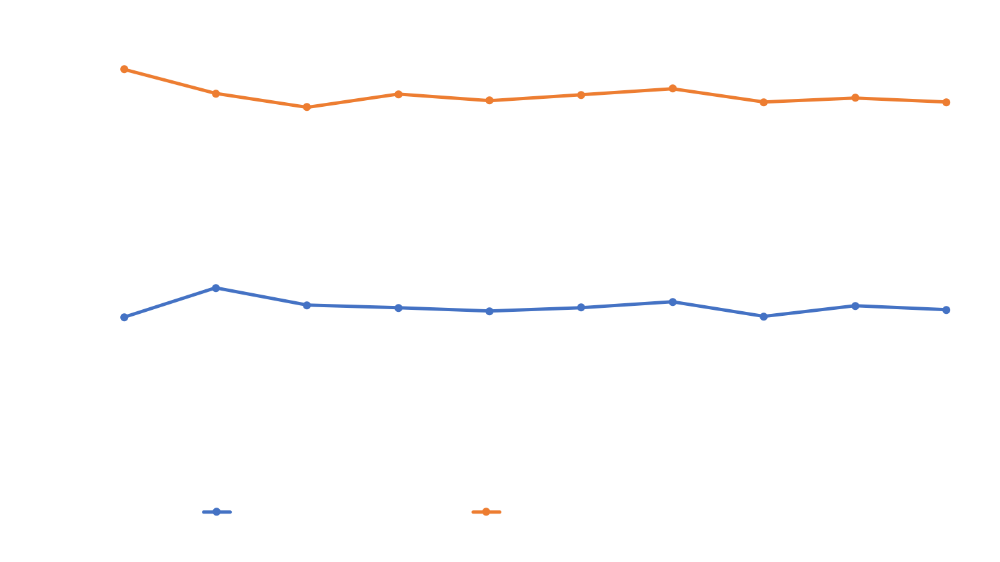 <!-- .element: style="height: 20vh; background: #141212" -->

> rendering a simple &lt;span&gt; in React [...] is between 2.15M to 2.2M CPU instructions. Then wrapping the &lt;span&gt; in a &lt;p&gt; takes us to about 2.3M instructions.

[JavaScript component-level CPU costs](https://calendar.perfplanet.com/2019/javascript-component-level-cpu-costs/)

---

As **you are not in control of the carbon footprint of your visitors**, but in control of your server try **moving logic back to it**.

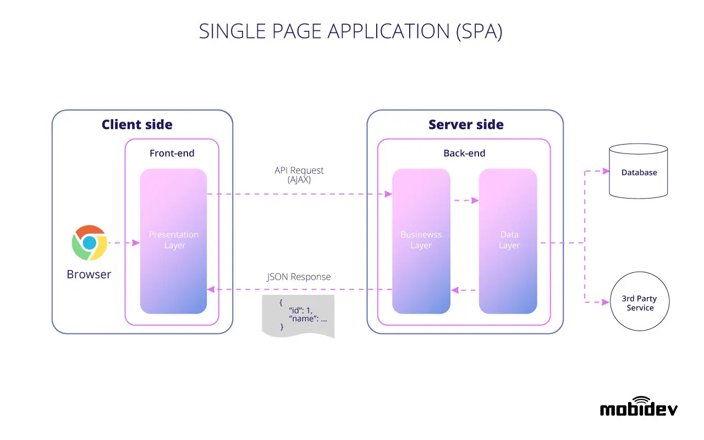

👉🏼 <!-- .element style="align-self: center" -->

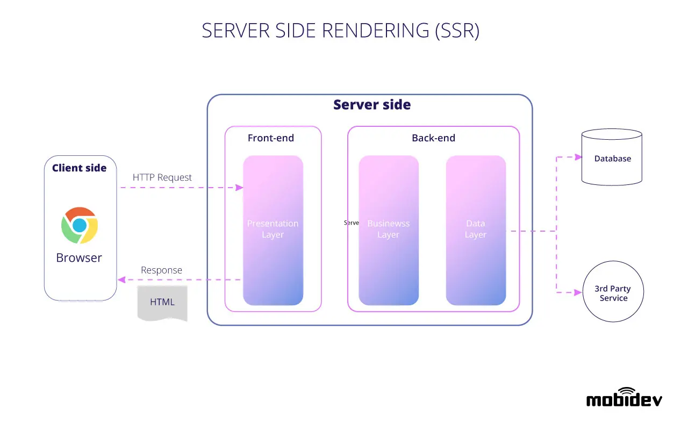

Source: [mobidev.biz](https://mobidev.biz/blog/web-application-architecture-types)

---

If you need a lot of interactivity, consider a **"HTML Over the Wire"** approach.

 <!-- .element: style="height: 2vh" -->

 <!-- .element: style="height: 2vh" -->

 <!-- .element: style="height: 2vh" -->

 <!-- .element: style="height: 2vh" -->

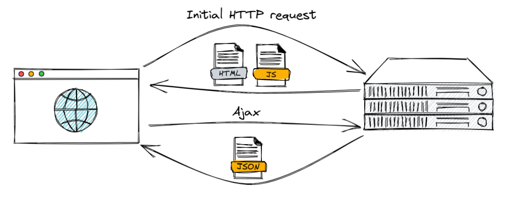 SPA

vs. <!-- .element style="align-self: center" -->

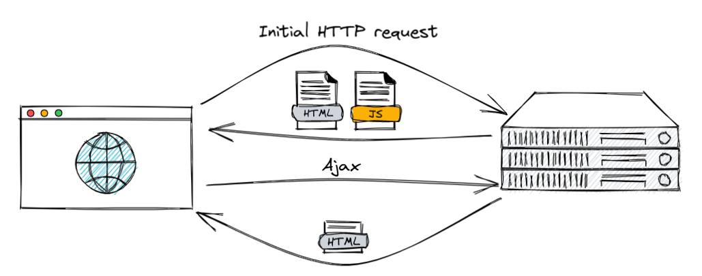 HTML over the Wire

---

Speaking of Servers, Backend, and maybe even Build Pipelines...

---

If you've already written the most efficient code and tuned your infrastructure to the max... 

---

Maybe switch to a more efficent language? 

## Certain server-Side Languages are more efficient than others

---

 <!-- .element: style="height: 20vh" -->

Researchers ran energy tests of 27 programming languages, using standardized algorithmic problems from a project called the ["Computer Language Benchmarks Game"](https://benchmarksgame-team.pages.debian.net/benchmarksgame/)

[Energy Efficiency across Programming Languages (2017)](https://greenlab.di.uminho.pt/wp-content/uploads/2017/10/sleFinal.pdf)

---

 <!-- .element: style="height: 33vh" -->

**Compiled languages fare hugely better** than interpreted languages  
(with the exception of Java & JavaScript)

---

Also: The **less transformation layers** in your stack the better.

 <!-- .element: style="height: 33vh" -->

<small>SSVM = Second State WebAssembly VM = Runs (Rust code compiled to) WebAssembly</small>

[Evaluation of software stack performance](https://www.infoq.com/articles/arm-vs-x86-cloud-performance/#:~:text=on%20GitHub.-,Less%20software%20bloat,-To%20preserve%20software)

---

## Choose more energy efficient hardware

 <!-- .element: style="height: 25vh" -->

> ARM processors are designed to have the lowest possible energy consumption while maintaining high processing power.

[The next big thing – ARM architecture](https://www.layerstack.com/blog/the-next-big-thing-arm-architecture/)

---

Let your next **development machine** be a Mac!  
(or a "Snapdragon X" laptop for that matter)

 <!-- .element: style="height: 15vh" -->

And think about ARM-based **servers**, too, which you can get here:

* [Hetzner](https://www.golem.de/news/cloud-hosting-hetzner-vermietet-kleinere-und-guenstigere-arm-server-2304-173366.html)
* [CloudFlare](https://blog.cloudflare.com/designing-edge-servers-with-arm-cpus/)
* [Amazon EC2](https://aws.amazon.com/de/ec2/graviton/)
* [Google Cloud](https://cloud.google.com/compute/docs/instances/arm-on-compute)
* [Microsoft Azure](https://azure.microsoft.com/en-us/blog/azure-virtual-machines-with-ampere-altra-arm-based-processors-generally-available/)

---

## Finally: Let's talk about Displays

---

### OLEDs vs LCDs

 <!-- .element: style="width: auto; height: 33vh" -->

**OLEDs use self-illuminating pixels**. 

Therefore only bright pixels consume energy.

---

OLEDs **are very efficient in showing dark images**. 

They **are less efficient at displaying white images**. 

However, the white images an OLED can display are of higher quality and brightness, but in doing so, this requires more energy consumption than LCD.

[Battery Power Online](https://www.batterypoweronline.com/news/oled-displays-impact-on-battery-life-for-consumer-tech-devices/)

---

 <!-- .element: style="height: 33vh" -->

OLED Displays in Smartphones Reach 49% Global Market Share in Q1’23

[Display Daily](https://displaydaily.com/oled-displays-in-smartphones-reach-49-global-market-share-in-q123/)

---

Increased OLED use is the reason we have more and more "always on" lock screens.

---

### OLEDs love Dark Mode!

[Android Dev Summit 2018](https://www.youtube.com/watch?v=N_6sPd0Jd3g)

---

Make Dark Mode the default!

---

## Energy Cost of Color

---

 <!-- .element: style="height: 33vh" -->

With OLED screens, **blue color consumes up to 24% more energy** than green or red.

[Android Dev Summit 2018](https://www.youtube.com/watch?v=N_6sPd0Jd3g)

---

[Android Dev Summit 2018](https://www.youtube.com/watch?v=N_6sPd0Jd3g)

---

 <!-- .element: style="width: auto; height: 25vh" -->

> **Higher frequencies contain more energy** at the same amplitude.
>
> Blue light has a **shorter wavelength** than red or green.

[Quora](https://www.quora.com/Why-do-certain-colors-like-blue-consume-more-energy-on-a-screen-than-red-and-green/answer/Per-Westermark-1)

---

 <!-- .element: style="width: auto; height: 25vh" -->

 <!-- .element: style="width: auto; height: 25vh" -->

> If you look at LED, a red LED might need 1.6V while a green may need 2.2V and a blue LED may need 3V.

[Quora](https://www.quora.com/Why-do-certain-colors-like-blue-consume-more-energy-on-a-screen-than-red-and-green/answer/Per-Westermark-1)

---

### Use energy efficient Color Palettes

 <!-- .element: style="width: auto; height: 10vh; margin: 0; aspect-ratio: 16/9; object-fit: cover; outline: 20px solid var(--r-background-color); outline-offset: -10px;" -->

 <!-- .element: style="width: auto; height: 10vh; margin: 0; aspect-ratio: 16/9; object-fit: cover; outline: 20px solid var(--r-background-color); outline-offset: -10px;" -->

 <!-- .element: style="width: auto; height: 10vh; margin: 0; aspect-ratio: 16/9; object-fit: cover; outline: 20px solid var(--r-background-color); outline-offset: -10px;" -->

 <!-- .element: style="width: auto; height: 10vh; margin: 0; aspect-ratio: 16/9; object-fit: cover; outline: 20px solid var(--r-background-color); outline-offset: -10px;" -->

[Energy efficient color palette ideas](https://greentheweb.com/energy-efficient-color-palette-ideas/)

