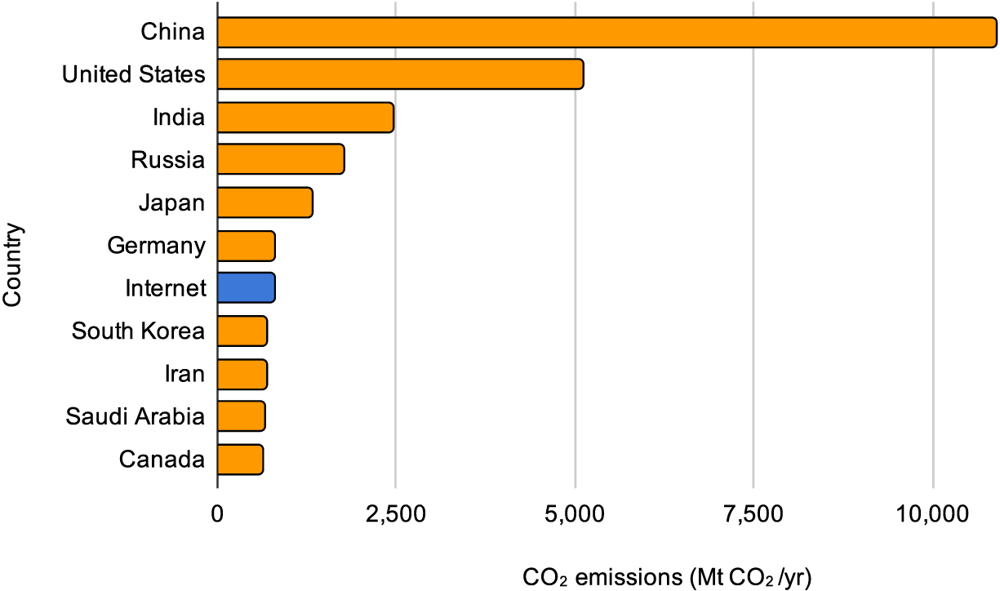

## Sustainable Web Design

---

> At a time when we need to be moving rapidly towards a zero-carbon economy, our hunger for data and web services is growing ever greater—as are our internet emissions. A 2018 paper published in the Journal of Cleaner Production estimated that communication technology will use **14 percent** of global electricity by 2040, up from just under 4 percent in 2020

[Assessing ICT global emissions footprint: Trends to 2040 & recommendations](https://www.sciencedirect.com/science/article/abs/pii/S095965261733233X)

---

Data for 2018 shows that when viewed as a whole, **the internet is equivalent to one of the world’s most polluting countries**.

---

**Sustainable web design** is an approach to designing web services **that prioritizes the health of our home planet**. 

---

At its **core** is a focus on reducing **carbon emissions and energy consumption**.
