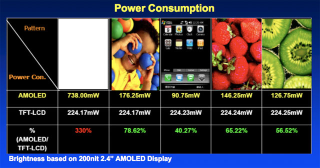
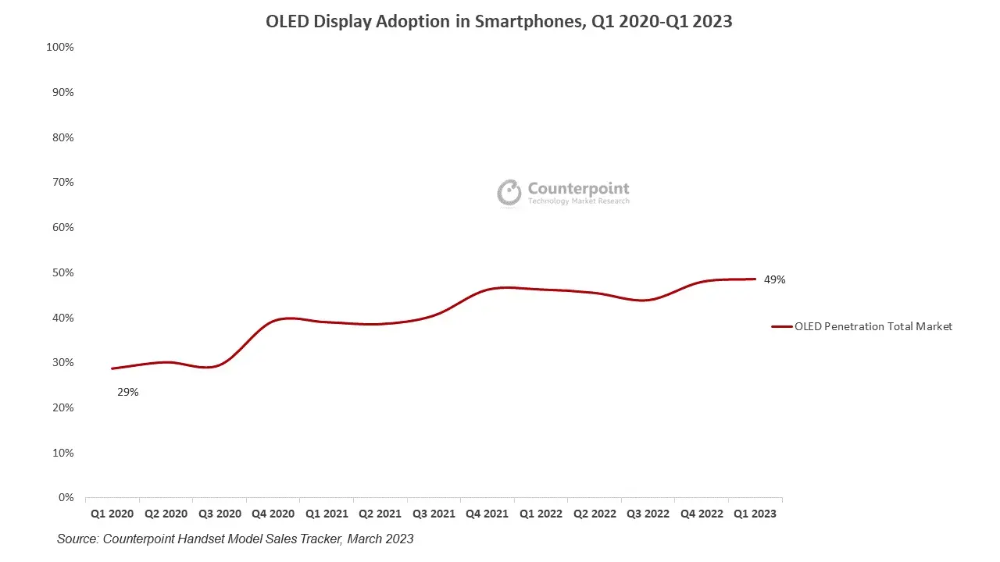
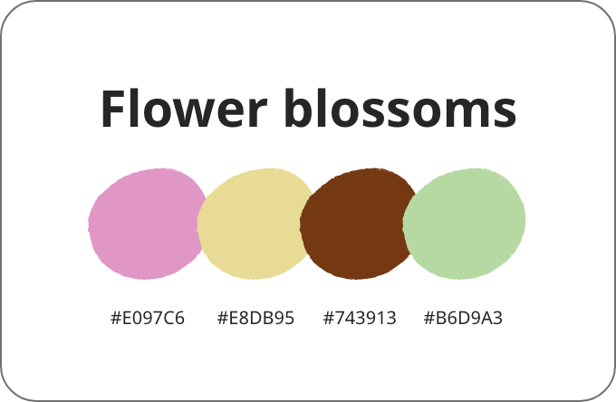
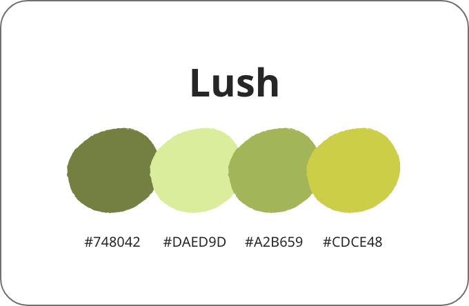
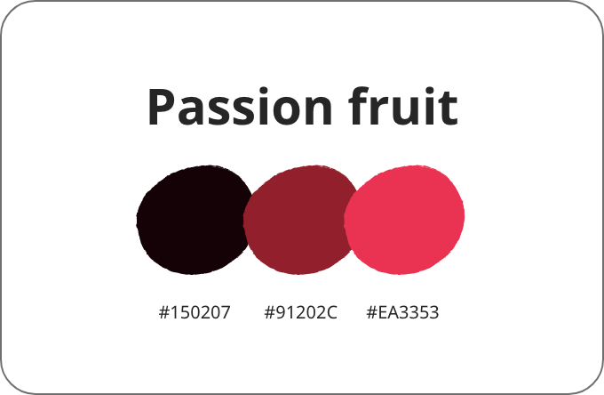
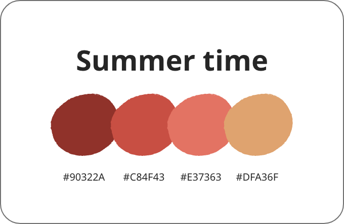

# UI Design

---

## Let's talk about OLED Displays

---

 <!-- .element: style="width: auto; height: 33vh" -->

> OLEDs use self-illuminating pixels; because of this and because they do not require backlighting, OLEDs do not consume as much power as LCDs. 

---

> They are optimized for what the industry calls “Perfect Black.” They can be more energy efficient when displaying darker images or using low levels of brightness.

---

> Because OLEDs prefer darker images, **they are less efficient at displaying white images**. However, the white images an OLED can display are of higher quality and brightness, but in doing so, this requires more energy consumption than LCD.   
> In the marketplace, for example, **a laptop with an OLED display** using high-white content like typical webpage browsing, Microsoft Office work, and more, **will typically have a six-to-seven-hour battery life whereas a traditional LCD display will have a 10-to-11-hour battery life**.

[Battery Power Online](https://www.batterypoweronline.com/news/oled-displays-impact-on-battery-life-for-consumer-tech-devices/)

---

> **OLED displays use 40% of the power of an LCD displaying an image that is primarily black** as they lack the need for a backlight, while **OLED can use more than three times as much power to display a mostly white image compared to an LCD.**

[Wikipedia](https://en.wikipedia.org/wiki/Comparison_of_CRT,_LCD,_plasma,_and_OLED_displays#:~:text=OLED%20displays%20use%2040%25%20of,image%20compared%20to%20an%20LCD.) / [Ars Technica](https://arstechnica.com/gadgets/2009/08/this-september-oled-no-longer-three-to-five-years-away/)

---

[Android Dev Summit 2018](https://www.youtube.com/watch?v=N_6sPd0Jd3g)

---

---

> OLED Displays in Smartphones Reach 49% Global Market Share in Q1’23

[Display Daily](https://displaydaily.com/oled-displays-in-smartphones-reach-49-global-market-share-in-q123/)

---

Increased OLED use is the reason we have more and more "always on" lock screens.

---

### But...

---

> OLED penetration to reach 14% of mobile PC displays in 2028

[OMDIA](https://omdia.tech.informa.com/OM029526/Display-Dynamics--January-2023-OLED-penetration-to-reach-14-of-mobile-PC-displays-in-2028)

---

### Solution

Default to **the mode that fits the display** tech best:

---

## Energy Cost of Color

---

With OLED screens, **blue color consumes up to 24% more energy** than green or red.

[Android Dev Summit 2018](https://www.youtube.com/watch?v=N_6sPd0Jd3g)

---

[Android Dev Summit 2018](https://www.youtube.com/watch?v=N_6sPd0Jd3g)

---

 <!-- .element: style="width: auto; height: 25vh" -->

> **Higher frequencies contain more energy** at the same amplitude.
>
> Blue light has a **shorter wavelength** than red or green.

[Quora](https://www.quora.com/Why-do-certain-colors-like-blue-consume-more-energy-on-a-screen-than-red-and-green/answer/Per-Westermark-1)

---

 <!-- .element: style="width: auto; height: 25vh" -->

 <!-- .element: style="width: auto; height: 25vh" -->

> If you look at LED, a red LED might need 1.6V while a green may need 2.2V and a blue LED may need 3V.

[Quora](https://www.quora.com/Why-do-certain-colors-like-blue-consume-more-energy-on-a-screen-than-red-and-green/answer/Per-Westermark-1)

---

 <!-- .element: style="width: auto; height: 20vh; aspect-ratio: 16/9; object-fit: cover; outline: 20px solid var(--r-background-color); outline-offset: -10px;" -->

 <!-- .element: style="width: auto; height: 20vh; aspect-ratio: 16/9; object-fit: cover; outline: 20px solid var(--r-background-color); outline-offset: -10px;" -->

 <!-- .element: style="width: auto; height: 20vh; aspect-ratio: 16/9; object-fit: cover; outline: 20px solid var(--r-background-color); outline-offset: -10px;" -->

 <!-- .element: style="width: auto; height: 20vh; aspect-ratio: 16/9; object-fit: cover; outline: 20px solid var(--r-background-color); outline-offset: -10px;" -->

[Energy efficient color palette ideas](https://greentheweb.com/energy-efficient-color-palette-ideas/)

---

* Transfer Volume
* CPU HTML > CSS > JS
* GPU image formats
* Screen OLED
* SPA vs. HTMx vs. SSR
* Old devices obsolete
